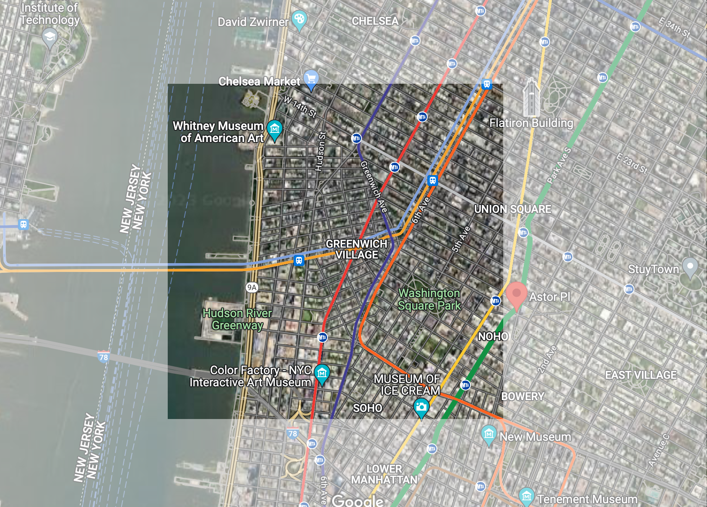

# Kips Bay

## Highlighted Map

## Basic Demographics/Statistics
The population of Greenwich Village is 2,142 divided among 1.47 square miles of land. This means that there are about 1,456.95 people per square mile. Of the population residing in Greenwich Village, the median age is approximately 32.7 years. The sex, race, and ethnicity breakdown is relatively even with 50% Female and 50% Male. Greenwich Village is composed of a predominantly White population - making up 94.3% of the population. Around 97.11% of the population is native-born, the largest portion of the population that are foreign born came from Latin America with around 40.32% of the foreign born population coming in 2000 to 2009. A majority of the population has attained a high school graduation or higher and 36.94% has attained a bachelor’s degree or higher. To add on, the Greenwich Village population is relatively successful in maintaining their education rate as their school dropout rate is 0%. The majority of The Village speaks English and 97.78% of the population 5 years and over speak only English. In terms of income, the per capita income is around $33,503 and the median household income is $69,875. A majority of the people in Greenwich Village are employed, comprising 97.02% of the population.  

## Summary of HC 3

## Summary of HC 4

## Summary of HC 7 & 8

## Kips Bay Map
<iframe src="KipsBayMap.html" width="830" height="400" frameborder="0" frameborder="0" marginwidth="0" marginheight="0" allowfullscreen></iframe>
