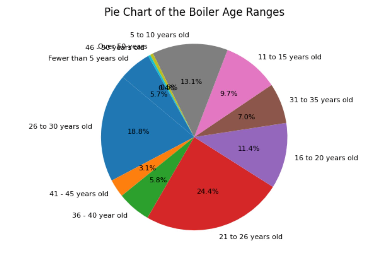

# Greenwich Village

## Highlighted Map

## Basic Demographics/Statistics
#### Population: 2,142 people 
#### Population density: 1,456.95 people per square mile
#### Median Age: 32.7 years. 
#### Gender Ratio: 50% Female and 50% Male.
#### Percentage of Population White: 94.3% 
#### Native-born percentage: 97.11% 
#### Education: 36.94% Bachelor's Degree or higher
#### High School dropout rate: 0%
#### Speak ONLY English at age of 5: 97.78% 
#### Per capita income: $33,503 
#### Median household income: $69,875
#### Percentage employed: 97.02%

## NYC Clean Heat Program (HC 3)
Fuel Oils No.4 and No.6 have caused a substantial impact on the environment. As a result, NYC has proposed various programs to lessen the stress on the environment including the Clean Heat Program and the DEP Boiler Registration. The Clean Heat Program essentially helps city buildings convert to cleaner heating fuels, encouraging the transition to cleaner burning fuels. The DEP Boiler Registration is a program where any new boiler system registered with NYCDEP is put into a triennial cycle of registration which helps point out boilers that are significantly contributing to pollution. Another possible solution includes a transition into electrification or renewable natural gas. 

## NYC Emissions (HC 4)
In Manhattan, there are multiple geographical points where the gas emission is much more concentrated. These properties include NYC City Housing Authorities, Rockefeller University, SL Green Realty Corp, and Jamestown Premier Che. The main contributors to the number of greenhouse gas emissions appear to be large buildings, contributing an average of 38 million metric tons of carbon dioxide per year since 2010. However, over time NYC aims to improve its carbon footprint by passing legislation and transitioning to renewable energy. For instance, a new law to begin in 2026 states that for new buildings of seven stories or less fossil fuels will not be used in the construction of them.

## Data Exploration and Analysis

**Mean Boiler Capacity**

Kips Bay has the highest Mean Boiler Capacity which may possibly be attributed to the population density, which is the largest in comparison to the other neighborhoods. Since the number of people per square mile is higher, it makes sense that the boiler capacity would also need to be higher in order to keep the area warm for a larger number of people. This is data after it was filtered as the outliers skewed the data to the point that it made little sense.

**Mean Total Gallons (high)**
.png)

The explanation for this data could be that Hells Kitchen boilers are larger than the ones in the other boroughs. This also disputes the possibility that mean boiler capacity directly correlates with the gallons used in each neighborhood. It is also important to note that the Mean Total Gallons high for Hells Kitchen is significantly larger in comparison to the other neighborhoods.

**Mean Total Gallons (low)**
.png)

Again, Hells Kitchen utilizes the most number of mean total gallons in comparison to the other neighborhoods. It does not change the fact that there is little correlation between Mean Boiler Capacity and Mean Total Gallons used. The amount of mean total gallons used is comparable in Soho, Kips Bay, and Greenwich. However, the Upper East Side and Helsl Kitchen provides a spike in the data. 

**Mean Total MMBTU (high)**
.png)

This chart demonstrates the correlation between BTU in boiler capacity and MMBTU of each neighborhood. Kips Bay has the highest Mean Total MMBTU (high) along with the largest boiler capacity. The data overall amongst the neighborhoods remains relatively similar without any substantial outliers between the data.

**Mean Total MMBTU (low)**
.png)

A similar trend is found in the Mean Total MMBTU low and high, proving that boiler capacity and mean total MMBTU correlate. Essentially, Kips Bay's boilers will produce more heat  than the other neighborhoods and Soho will produce the least. However the difference between Kips Bay and Soho is approximately 2500 which is still relatively comparable.

**Boiler Age Range**

A majority of the boilers are between the range of 21 to 26 years old. The general age range of which they lay is between 16 and 30 which can be used as a benchmark median if a user wanted to interpret the data. However, this brings up the issue that only 13.1% of these boilers would bea part of the NYC DEP Boiler Registration Renewal program. 

**Total Gallons vs Floor**

There is no correlation between the total gallons of fuel used and the number of floors in a building. Looking at the chart, there is no downward or upward trend. This may be attributed to the differing uses of buildings which is independent of the number of floors in a building. In other words, the function of the building determines its dependence on heat in comparison to the number of floors.

**Greener Greater Buildings**

The greatest number of Greener Greater Buildings is in the Upper East Side. This may be attributed to the fact that the median income of the residents in the Upper East Side is the highest incomparison to the residents of the other neighborhoods. The neighborhoods that were least affected include Soho and Hells Kitchen.

## Map of Boilers in neighborhood
<iframe src="KipsBayMap.html" width="830" height="400" frameborder="0" frameborder="0" marginwidth="0" marginheight="0" allowfullscreen></iframe>
